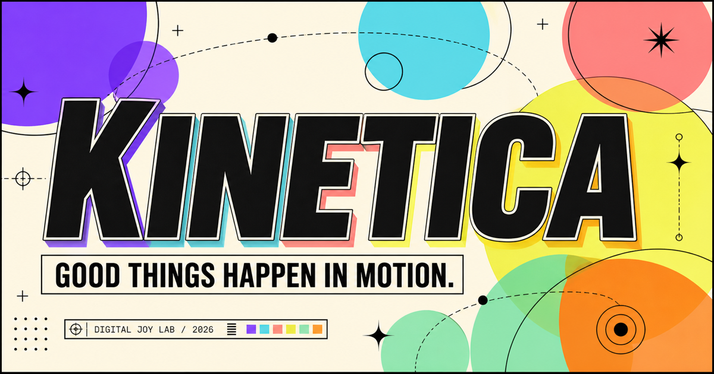

# KINETICA — Digital Joy Lab

KINETICA is an interactive, motion-rich editorial playground built with Next.js and React. It combines draggable objects, three motion modes, three tempos, a persistent four-theme mood mixer, global motion controls, reduced-motion support, and a fully responsive art direction.

[Open the live experience](https://kinetica-digital-joy-lab.netlify.app) · [Review the production evidence](docs/release-evidence.md)



## What makes it different

- Six draggable, keyboard-movable objects inside a live motion playground
- Drift, bounce, and orbit physics with calm, alive, and loud tempo controls
- Click- and touch-generated sparks, reactive energy, and shuffled palettes
- Four persistent visual frequencies: Electric, Sunset, Cool, and Ink
- Global motion pause, automatic reduced-motion support, and touch-safe targets
- An editorial visual system built from custom CSS rather than a component template

## Production quality

- Production deployment on Netlify with a strict Content Security Policy and defensive browser headers
- Responsive verification in a real Chrome profile across desktop and a 390 × 844 mobile viewport
- Every visible control exercised in production: 28/28 desktop and 24/24 mobile
- Keyboard, pointer drag, state persistence, interaction stress, console, asset, and 404 coverage
- Automated lint, type, build, rendered-output, and production dependency-audit gates

See the [release evidence matrix](docs/release-evidence.md) for the full verification scope and the few intentionally not-applicable checks.

## Architecture

- Next.js 16 App Router and React 19
- TypeScript with a native, semantic interaction layer
- CSS-driven art direction and motion, with device-persisted UI preferences
- Native Next.js deployment on Netlify plus a Cloudflare-compatible Sites build
- No authentication, database, analytics tracker, or third-party runtime API

## Local development

```bash
npm install
npm run dev
```

## Release checks

```bash
npm run verify
```

`npm run build` creates the Cloudflare-compatible Sites build. `npm run build:netlify` creates the native Next.js build used by Netlify.

The same release suite runs on every push and pull request through GitHub Actions.

## Accessibility

- Native links, buttons, radio groups, landmarks, and one logical heading hierarchy
- Keyboard-movable lab objects with visible focus styles
- Global pause/resume control persisted on the device
- Automatic `prefers-reduced-motion` support
- Touch-safe targets and responsive layouts down to 320px
- Polite live status updates for lab actions
